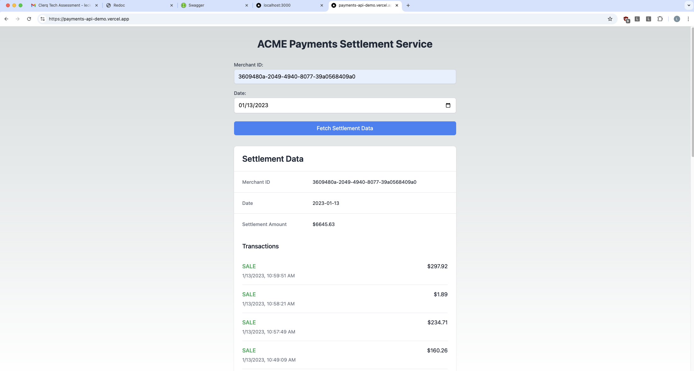

## Getting Started

To run the development server:

```bash
npm install
# then
npm run dev
```

Open [http://localhost:3000](http://localhost:3000) with your browser to see the result. Alternatively, this project is also deployed on Vercel at [https://payments-api-demo.vercel.app/](https://payments-api-demo.vercel.app/).

[API routes](https://nextjs.org/docs/api-routes/introduction) can be accessed on [http://localhost:3000/api/getSettlement](http://localhost:3000/api/getSettlement) or [https://payments-api-demo.vercel.app/api/getSettlement](https://payments-api-demo.vercel.app/api/getSettlement). This endpoint can be edited in `pages/api/getSettlement.ts`.

The interactive frontend UI can be viewed in `pages/index.tsx`. Built with React, TypeScript, and TailwindCSS.


## Testing

To test the API endpoint, you can use the following curl command:

```bash
curl http://localhost:3000/api/getSettlement?merchantId=3609480a-2049-4940-8077-39a0568409a0&date=2023-01-13
# or (in prod)
curl https://payments-api-demo.vercel.app/api/getSettlement?merchantId=3609480a-2049-4940-8077-39a0568409a0&date=2023-01-13
```

## Screenshot

